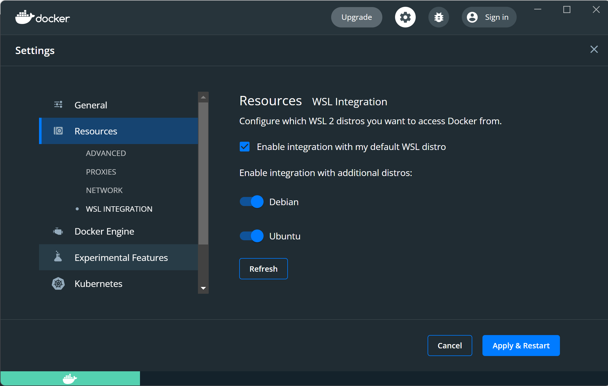

# install WSL (Example on Debian)
## Install Windows Terminal in Microsoft Store
## Install PowerShell if doesnt exists
## Install wsl
```powershell
# powershell

# list of distro:
wsl --list --online
# wsl --install -d {SOME DISTRO FROM LIST}
wsl --install -d Debian
```
## Setting up profile in Debian
1. next will be opened Windows Terminal
2. and next step: just fill all fields, username, password, etc.


# install some useful packages
## git
```bash
sudo apt-get update
sudo apt-get install git
ssh-keygen -t ed25519 -C "your_email@example.com"
cat ~/.ssh/id_ed25519.pub  # add this public key to github profile settings ssh keys
eval "$(ssh-agent -s)"
ssh-add ~/.ssh/id_ed25519
```

## docker
```
sudo apt-get update

sudo apt-get install \
    ca-certificates \
    curl \
    gnupg \
    lsb-release

sudo mkdir -p /etc/apt/keyrings

curl -fsSL https://download.docker.com/linux/ubuntu/gpg | sudo gpg --dearmor -o /etc/apt/keyrings/docker.gpg

echo \
  "deb [arch=$(dpkg --print-architecture) signed-by=/etc/apt/keyrings/docker.gpg] https://download.docker.com/linux/ubuntu \
  $(lsb_release -cs) stable" | sudo tee /etc/apt/sources.list.d/docker.list > /dev/null

sudo apt-get update
sudo apt-get install docker-ce docker-ce-cli containerd.io docker-compose-plugin
```

install docker desktop and go to settings and turn on required distro


```bash
# add permissions
sudo groupadd docker
sudo usermod -aG docker $USER
# after that just reload terminal
```

## install docker-compose
```bash
sudo apt-get update && sudo apt-get upgrade
sudo curl -L "https://github.com/docker/compose/releases/download/1.29.2/docker-compose-$(uname -s)-$(uname -m)" -o /usr/local/bin/docker-compose
```


## Python 3.10
```
sudo apt-get update && sudo apt-get upgrade
sudo apt-get install software-properties-common -y
sudo add-apt-repository ppa:deadsnakes/ppa
sudo apt-get install python3.10
```

# Install Oh-My-Zsh and beautiful power line
```bash
sudo apt-get update
sudo apt-get install zsh
# run zsh and choose 2-nd option
zsh

# then install ohmyzsh
sh -c "$(curl -fsSL https://raw.github.com/ohmyzsh/ohmyzsh/master/tools/install.sh)"

# DONE!!! -> next step: install power line
git clone https://github.com/romkatv/powerlevel10k.git $ZSH_CUSTOM/themes/powerlevel10k

# Then you need to enable it, change the value of ZSH_THEME to following in ~/.zshrc file :
ZSH_THEME="powerlevel10k/powerlevel10k"
# reload and go to config your power line:)))
```
